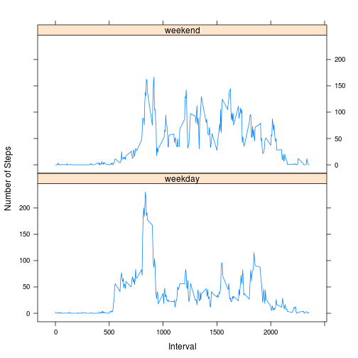

# Reproducible Research: Peer Assessment 1


## Loading and preprocessing the data
First unzip the data if that has not already been done. Then 
load the raw data as the data frame "rawDF".  


```r
zipName <- "activity.zip"
rawFile <- "activity.csv"

## Unzip the data
if(!file.exists(rawFile)) {
    unzip(zipName)
    print("I unzipped") #debug
}

## TEST AREA
### Load a sample of data into memory as a data frame
# rawDF <- read.csv(file = rawFile, header = TRUE
#                  , nrows = 20)
### Let's take a peak at what it looks like
# head(rawDF)
## Now we know that the columns are numeric, date %Y-$m-$d, and numeric
## Load the data into memory as a data frame
rawDF <- read.csv(file = rawFile, header = TRUE
                  , na.strings = "NA"
                  , colClasses = c("numeric", "character", "numeric"))
summary(rawDF)
```

```
##      steps           date              interval   
##  Min.   :  0.0   Length:17568       Min.   :   0  
##  1st Qu.:  0.0   Class :character   1st Qu.: 589  
##  Median :  0.0   Mode  :character   Median :1178  
##  Mean   : 37.4                      Mean   :1178  
##  3rd Qu.: 12.0                      3rd Qu.:1766  
##  Max.   :806.0                      Max.   :2355  
##  NA's   :2304
```

```r
## skip this for now. doesn't work as a key
## convert the date column into a POSIXTL
# rawDF$date <- strptime(rawDF$date, format = "%Y-%m-%d")
```
This is data frame has column headers steps, date, interval

## What is mean total number of steps taken per day?
As directed, we will ignore the missing values for this section
The total number of steps taken each day, in histogram form:


```r
library(data.table)

DT <- as.data.table(rawDF)
setkey(DT, date)

dailySteps <-DT[,list(sumsteps=sum(steps, na.rm=TRUE))
                ,by=date]
head(dailySteps)
```

```
##          date sumsteps
## 1: 2012-10-01        0
## 2: 2012-10-02      126
## 3: 2012-10-03    11352
## 4: 2012-10-04    12116
## 5: 2012-10-05    13294
## 6: 2012-10-06    15420
```

```r
hist(dailySteps$sumsteps, breaks=21
     , main = "Histogram of Daily Steps"
     , xlab = "Steps")
```

 

```r
meanSteps <- mean(dailySteps$sumsteps, na.rm = TRUE)
medianSteps <- median(dailySteps$sumsteps, na.rm = TRUE)
```

The mean and median total number of steps taken per day are, respectively, 9354.2295 and 1.0395 &times; 10<sup>4</sup>.


## What is the average daily activity pattern?


```r
avgDay <-DT[,list(avgsteps=mean(steps
                               , na.rm=TRUE))
            ,by=interval]
plot(avgsteps ~ interval, data = avgDay
     , main = "Average Steps Taken Over a Day"
     , xlab = "Time interval (min)"
     , ylab = "Steps"
     , type = "l")
```

 

```r
## note this returns index of FIRST maximum
idxMax <- which.max(avgDay$avgsteps)  
intervalMax <- avgDay$interval[idxMax]
stepMax <- avgDay$avgsteps[idxMax]
```
On average, the interval with the maximum number of steps is the
5-minute interval starting at the 835 minute of the day.

## Imputing missing values

1. Calculate and report the total number of missing values in the dataset (i.e. the total number of rows with NAs)


```r
DT$isNA <- is.na(DT$steps) 
numNAs <- sum(DT$isNA)
```
There are 2304 rows with NA in the steps column.

2. Devise a strategy for filling in all of the missing values in the dataset. The strategy does not need to be sophisticated. For example, you could use the mean/median for that day, or the mean for that 5-minute interval, etc.

*I will fill the NA's with the mean for that 5-minute interval. 
We've already computed the average steps in each interval for 
the previous problem, so whenever there's an NA, copy over the
average value.*

3. Create a new dataset that is equal to the original dataset but with the missing data filled in.

*Let's add this as a new column in the data table, with name 
"newSteps".*


```r
for(i in 1:length(DT$interval)) {
    if(DT$isNA[i]) {
        idx <- which(avgDay$interval == DT$interval[i])
        DT$newSteps[i] <- avgDay$avgsteps[idx]
    } else {
        DT$newSteps[i] <- DT$steps[i]        
    }
}
## summary(DT) 
```

4. Make a histogram of the total number of steps taken each day and Calculate and report the mean and median total number of steps taken per day. Do these values differ from the estimates from the first part of the assignment? What is the impact of imputing missing data on the estimates of the total daily number of steps?


```r
noNASteps <-DT[,list(sumsteps=sum(newSteps, na.rm=TRUE))
                ,by=date]

hist(noNASteps$sumsteps, breaks=21
     , main = "Histogram of Daily Steps w/NA values imputted"
     , xlab = "Steps")
```

 

```r
NAmeanSteps <- mean(noNASteps$sumsteps, na.rm = TRUE)
NAmedianSteps <- median(noNASteps$sumsteps, na.rm = TRUE)

diffMeans <- NAmeanSteps - meanSteps
diffMedians <- NAmedianSteps - medianSteps
```

With the imputted values for the NAs, the new mean and median steps
per day are now 1.0766 &times; 10<sup>4</sup> and 1.0766 &times; 10<sup>4</sup>. We lose the
left skew (from the preponderonce of NA-turned-zeros) in the 
original histogram, so the mean and median of the data with the 
imputed NA values are now the same.  The imputed data's mean is 1411.9592 
greater than the raw data and the median is 371.1887 greater.


## Are there differences in activity patterns between weekdays and weekends?
*Using the dataset with the filled-in missing values for this part
as directed.*

1. Create a new factor variable in the dataset with two levels – “weekday” and “weekend” indicating whether a given date is a weekday or weekend day.

```r
rawDF$POSdate <- strptime(rawDF$date, "%Y-%m-%d")
newDF <- cbind(rawDF, DT$newSteps)
colnames(newDF)[5] <- "newSteps"

for(i in 1:length(newDF$interval)) {
    testDay <- weekdays(newDF$POSdate[i])
    if( (testDay == "Saturday") | (testDay == "Sunday") ) {
        newDF$isweekend[i] <- "weekend"
    } else {
        newDF$isweekend[i] <- "weekday"
    }
}

newDF$isweekend <- as.factor(newDF$isweekend)
newDF <- subset(newDF, select=c(isweekend, interval, newSteps))
newDT <- as.data.table(newDF)
```
2. Make a panel plot containing a time series plot (i.e. type = "l") of the 5-minute interval (x-axis) and the average number of steps taken, averaged across all weekday days or weekend days (y-axis).

```r
## Make the average weekday and weekend profile
avgs <- newDT[, list(avgSteps = mean(newSteps)), by = list(isweekend, interval)]

## Plot it
library(lattice)
xyplot(avgSteps ~ interval | isweekend, data = avgs, layout = c(1,2)
       , type="l"
       , xlab="Interval"
       , ylab="Number of Steps")
```

 
The weekend and weekdays profiles look roughly equal. You might say the peak around 
800 minutes is higher for the weekdays, but the other local maximums throughout 
the day are higher during the weekend. 
throughout
